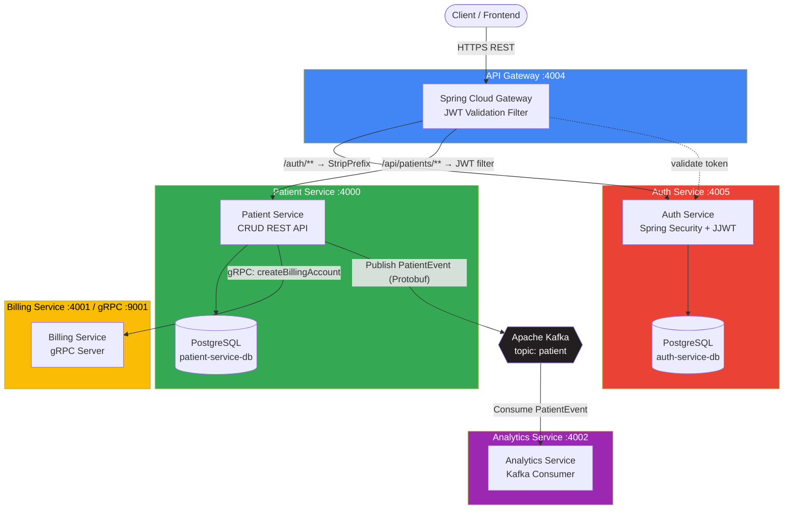

# 🏥 Patient Management System — Microservices Architecture

[](https://openjdk.org/)
[](https://spring.io/projects/spring-boot)
[](https://spring.io/projects/spring-cloud)
[](https://www.docker.com/)
[](https://grpc.io/)
[](https://kafka.apache.org/)
[](https://aws.amazon.com/cdk/)
[](#license)

A personal backend engineering project: a cloud-native **Patient Management System** built with a microservices architecture on Spring Boot / Spring Cloud. I designed and implemented this system to practice and demonstrate production-grade backend patterns — centralized API Gateway routing, JWT-based authentication, synchronous inter-service communication via **gRPC**, asynchronous event streaming via **Apache Kafka**, and Infrastructure-as-Code deployment to AWS using the **AWS CDK**.

**Author:** Phạm Trung Thiện — Java Backend Developer  
📧 phamtrungthien10052003@gmail.com · 🔗 [GitHub](https://github.com/TrungThien2003) 
---

## 📖 Table of Contents

- [Overview](#-overview)
- [Architecture](#-architecture)
- [Tech Stack](#-tech-stack)
- [Microservices](#-microservices)
- [REST API Endpoints](#-rest-api-endpoints)
- [Inter-Service Communication](#-inter-service-communication)
- [Getting Started](#-getting-started)
- [Environment Variables](#-environment-variables)
- [Infrastructure (AWS CDK)](#-infrastructure-aws-cdk)
- [Project Structure](#-project-structure)
- [License](#license)

---

## 🔍 Overview

This project simulates a real-world hospital/clinic backend split into independently deployable services. Each service owns its own PostgreSQL database (Database-per-Service pattern), communicates synchronously through the API Gateway or gRPC, and publishes domain events to Kafka for downstream analytics — all containerized with Docker and deployable to AWS via CDK-defined infrastructure (VPC, ECS Fargate, RDS, MSK, Route53 health checks).

**Key capabilities:**
- 🔐 Centralized authentication & JWT validation at the gateway edge
- 🧩 Independent, loosely-coupled microservices with their own data stores
- ⚡ High-performance synchronous communication via gRPC (Patient → Billing)
- 📨 Asynchronous, event-driven communication via Kafka + Protobuf (Patient → Analytics)
- 📄 Auto-generated OpenAPI/Swagger documentation, proxied through the gateway
- ☁️ Infrastructure-as-Code for AWS deployment (ECS Fargate, RDS, MSK)
- 🐳 Fully containerized with Docker for local development

---

## 🏗 Architecture



**Request flow example — creating a patient:**
1. Client sends `POST /api/patients` to the **API Gateway** with a `Bearer` JWT.
2. Gateway's `JwtValidationGatewayFilterFactory` calls **Auth Service** `/validate` to verify the token before forwarding.
3. Request is routed (with `StripPrefix`) to **Patient Service**.
4. Patient Service persists the patient, then:
   - Calls **Billing Service** synchronously via **gRPC** to create a billing account.
   - Publishes a `PatientEvent` (Protobuf) to the **Kafka** `patient` topic.
5. **Analytics Service** consumes the event asynchronously for downstream processing.

---

## 🧰 Tech Stack

| Layer | Technology |
|---|---|
| **Language / Runtime** | Java 21 |
| **Core Framework** | Spring Boot 3.4.x |
| **API Gateway** | Spring Cloud Gateway (Spring Cloud 2024.0.0) |
| **Security** | Spring Security, JJWT (JSON Web Token 0.12.6) |
| **Persistence** | Spring Data JPA, PostgreSQL, H2 (local/test) |
| **Sync Inter-Service Comm.** | gRPC 1.69 + Protocol Buffers 4.29 |
| **Async Messaging** | Apache Kafka, Spring Kafka 3.3.0 (Protobuf payloads) |
| **API Documentation** | springdoc-openapi (Swagger/OpenAPI 3, aggregated at the gateway) |
| **Validation** | Jakarta Bean Validation (spring-boot-starter-validation) |
| **Containerization** | Docker (multi-stage builds, Maven + Eclipse Temurin) |
| **Infrastructure as Code** | AWS CDK (Java) — VPC, ECS Fargate, RDS, MSK, Route 53 |
| **Build Tool** | Maven (multi-module) |
| **Testing** | JUnit 5, Spring Boot Test, Spring Security Test, integration tests |

---

## 🧩 Microservices

| Service | Port (REST) | Port (gRPC) | Responsibility |
|---|---|---|---|
| **api-gateway** | `4004` | — | Single entry point; routes requests, strips prefixes, enforces JWT validation, aggregates Swagger docs |
| **auth-service** | `4005` | — | User authentication, JWT issuance & validation, user store (PostgreSQL) |
| **patient-service** | `4000` | client | Patient CRUD, triggers billing account creation, publishes patient events to Kafka |
| **billing-service** | `4001` | `9001` (server) | Creates/manages billing accounts, exposed exclusively over gRPC |
| **analytics-service** | `4002` | — | Consumes `PatientEvent` messages from Kafka for analytics processing |
| **infrastructure** | — | — | AWS CDK stack (Java) provisioning VPC, RDS, ECS Fargate, MSK Kafka cluster |

---

## 🔌 REST API Endpoints

All external traffic goes through the **API Gateway** (`http://localhost:4004`).

### Auth Service — `/auth/**` (public)

| Method | Endpoint | Description |
|---|---|---|
| `POST` | `/auth/login` | Authenticate a user and issue a JWT |
| `GET` | `/auth/validate` | Validate a `Bearer` token (used internally by the gateway filter) |

### Patient Service — `/api/patients/**` (JWT-protected)

| Method | Endpoint | Description |
|---|---|---|
| `GET` | `/api/patients` | Retrieve the list of all patients |
| `POST` | `/api/patients` | Create a new patient (triggers billing account creation + Kafka event) |
| `PUT` | `/api/patients/{id}` | Update an existing patient by ID |
| `DELETE` | `/api/patients/{id}` | Delete a patient by ID |

### API Documentation (proxied)

| Method | Endpoint | Description |
|---|---|---|
| `GET` | `/api-docs/patients` | Rewrites to Patient Service's `/v3/api-docs` |
| `GET` | `/api-docs/auth` | Rewrites to Auth Service's `/v3/api-docs` |

> **Note:** Billing Service exposes no REST endpoints — it is accessed exclusively through gRPC (`createBillingAccount`), and Analytics Service exposes no REST API — it only consumes Kafka events.

---

## 🔗 Inter-Service Communication

| Pattern | From → To | Mechanism |
|---|---|---|
| **Synchronous (blocking)** | API Gateway → Auth Service | REST (`WebClient`, JWT validation filter) |
| **Synchronous (blocking)** | API Gateway → Patient/Auth Service | REST routing (Spring Cloud Gateway) |
| **Synchronous (RPC)** | Patient Service → Billing Service | **gRPC** (`BillingServiceGrpcClient` → `BillingGrpcService`) |
| **Asynchronous (event-driven)** | Patient Service → Analytics Service | **Kafka** topic `patient`, Protobuf-serialized `PatientEvent` |

---

## 🚀 Getting Started

### Prerequisites
- Java 21+
- Maven 3.9+
- Docker & Docker Compose
- An IDE with Maven and Docker support (e.g., IntelliJ IDEA)

### Run with Docker
Each service ships with a multi-stage `Dockerfile` (Maven build → `openjdk:21-jdk` runtime). Build and run each service container, providing the environment variables listed in [Environment Variables](#-environment-variables), or orchestrate them together with your own `docker-compose.yml` connecting:
- `auth-service-db`, `patient-service-db` (PostgreSQL)
- `kafka` (single-node broker)
- `auth-service`, `patient-service`, `billing-service`, `analytics-service`, `api-gateway`

### Run locally (per service)
```bash
cd patient-service
./mvnw spring-boot:run
```
Repeat for `auth-service`, `billing-service`, `analytics-service`, and `api-gateway` (start the gateway last).

---

## ⚙️ Environment Variables

<details>
<summary><strong>Patient Service</strong></summary>

```properties
BILLING_SERVICE_ADDRESS=billing-service
BILLING_SERVICE_GRPC_PORT=9001
SPRING_DATASOURCE_PASSWORD=password
SPRING_DATASOURCE_URL=jdbc:postgresql://patient-service-db:5432/db
SPRING_DATASOURCE_USERNAME=admin_user
SPRING_JPA_HIBERNATE_DDL_AUTO=update
SPRING_KAFKA_BOOTSTRAP_SERVERS=kafka:9092
SPRING_SQL_INIT_MODE=always
```
</details>

<details>
<summary><strong>Auth Service</strong></summary>

```properties
SPRING_DATASOURCE_PASSWORD=password
SPRING_DATASOURCE_URL=jdbc:postgresql://auth-service-db:5432/db
SPRING_DATASOURCE_USERNAME=admin_user
SPRING_JPA_HIBERNATE_DDL_AUTO=update
SPRING_SQL_INIT_MODE=always
```
</details>

<details>
<summary><strong>Billing Service</strong></summary>

```properties
server.port=4001
grpc.server.port=9001
```
</details>

<details>
<summary><strong>Notification / Analytics Service</strong></summary>

```properties
SPRING_KAFKA_BOOTSTRAP_SERVERS=kafka:9092
```
</details>

<details>
<summary><strong>Auth Service Database</strong></summary>

```properties
POSTGRES_DB=db
POSTGRES_PASSWORD=password
POSTGRES_USER=admin_user
```
</details>

> ⚠️ Passwords shown are development defaults — replace with secrets before any real deployment.

---

## ☁️ Infrastructure (AWS CDK)

The `infrastructure` module defines the full cloud topology in Java using the **AWS CDK**, provisioning:

- **VPC** spanning 2 Availability Zones
- **RDS PostgreSQL** instances for Auth and Patient services (with Route 53 TCP health checks)
- **Amazon MSK** (Managed Kafka) cluster for event streaming
- **ECS Fargate** services for every microservice, each with its own CloudWatch log group
- **Application Load Balancer** in front of the API Gateway
- **AWS Cloud Map** service discovery namespace (`patient-management.local`)

Deploy locally against LocalStack via `infrastructure/localstack-deploy.sh`.

---

## 📁 Project Structure

```
├── api-gateway/          # Spring Cloud Gateway – routing & JWT filter
├── auth-service/         # Authentication & JWT issuance
├── patient-service/      # Patient CRUD, gRPC client, Kafka producer
├── billing-service/      # gRPC billing account server
├── analytics-service/    # Kafka consumer for patient events
├── infrastructure/       # AWS CDK (Java) infrastructure-as-code
├── integration-tests/    # Cross-service integration tests
├── api-requests/         # .http request samples (REST)
└── grpc-requests/        # .http request samples (gRPC)
```

---

## License

This project is available for review as part of my personal backend development portfolio. Feel free to explore the code, open issues, or reach out with questions.

###### © 2026 Phạm Trung — Personal Portfolio Project
